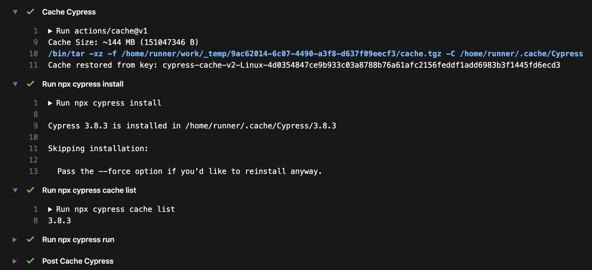

# cypress-gh-action-split-install 

> Example using [npm-install](https://github.com/bahmutov/npm-install) and manual [Cypress installation](https://github.com/cypress-io/github-action) inside GH Action.

See [.github/workflows/tests.yml](.github/workflows/tests.yml)

First, only NPM dependencies are installed (without Cypress binary).
Then Cypress binary is installed, used to run end-to-end tests, and cached.

